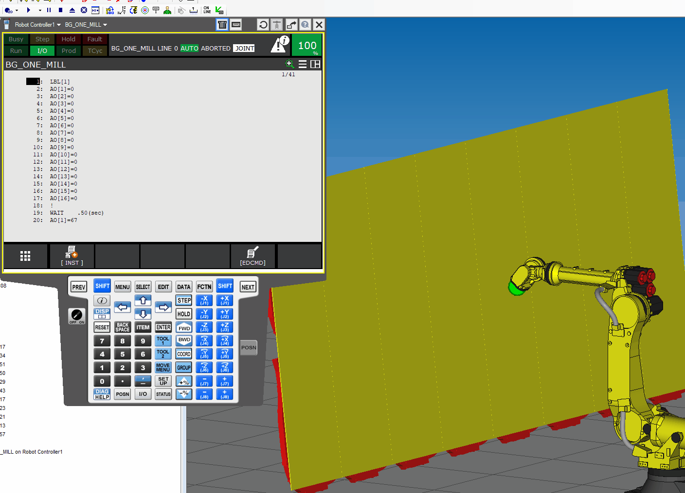

# The Wall
Machine definition file (*.def) to write letters to a "screen". This screen is called the wall, because of its size.

The chars are written by using an analog output.
Each output represents exactly one char.

0. configure you Analog outputs (1-16).
    - 

1. Copy this folder ('thewall') to machines folder inside Roboguide project.
    - 

2. Load the machine definition file "TheWall_2x8.def"
   - This might take some time.
   - there will be some errors pop up.(ignore them)
   - 

3. execute programs only in automatic mode

  - example prog 'WRITE_TEXT_ON_THE_WALL.LS'

  - There are big performance issues when running from TP with [SHIFT]+[FWD]
  - 

The definition file is a XML file.
Currently only ASCII chars  from 033-092 are supported.

So you can search and replace the colors and or names...

- YELLOW:Color="&amp;HFFFF"
- RED: Color="&amp;HFF"